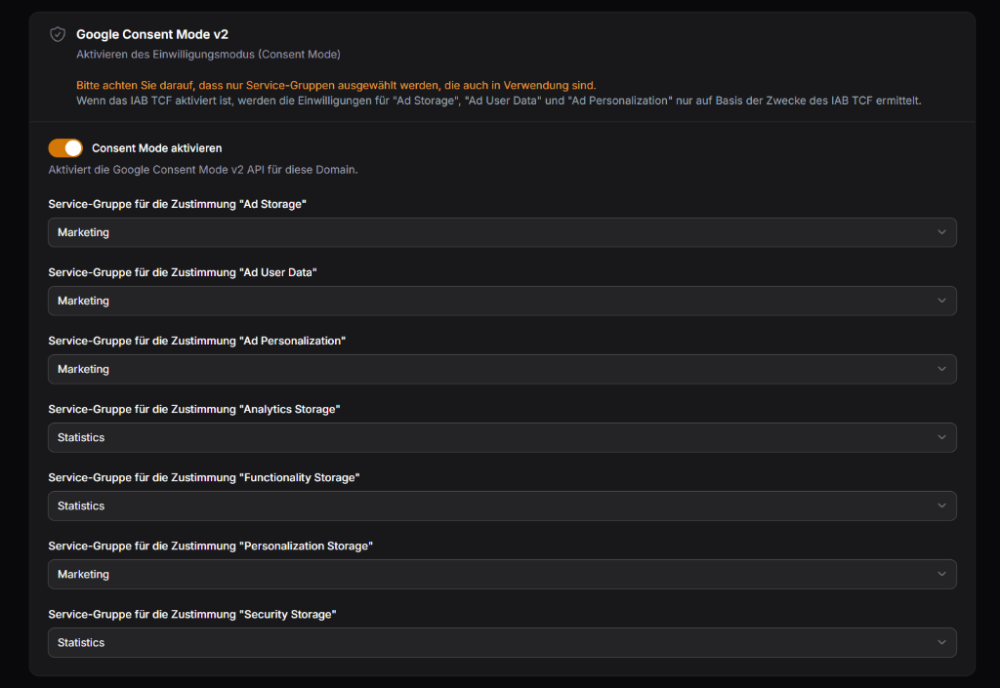
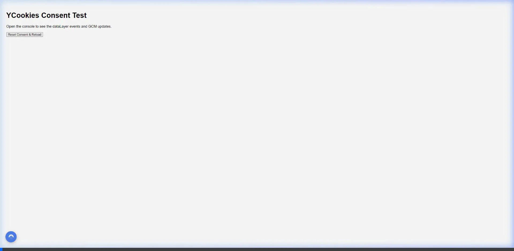

# YCookies

Self-Hosted Enterprise Cookie Consent Manager.

- Compliance: Consent Mode v2 + Geo + TCF v2.2
- Premium UI/UX: Live Preview + 250+ controls + 4 layouts
- Enterprise Scale: Redis <20ms + 10k domains + pagination
- Bulletproof Security: Shield 2FA + CSP + Audit logs + Rate limits
- Revenue Scanner: 300 templates + WP-CLI suite + Levenshtein
- SaaS Billing: Stripe MCP Pro/Agency + Domain limits + Wizard

## 🐳 Quick Start with Docker

Run the full platform anywhere with Docker — no platform-specific tooling required. Pre-built multi-arch images (amd64/arm64) are published to Docker Hub: `ypsilondev/ycookies` (control plane), `ypsilondev/ycookies-scanner` (scanner worker with Chromium), and `ypsilondev/ycookies-proxy` (consent reverse proxy).

```bash
git clone https://github.com/omarijbara/YCookies.git && cd YCookies/deploy
cp .env.example .env
# Fill in APP_URL, APP_KEY, DB_PASSWORD, DB_ROOT_PASSWORD, PROXY_SHARED_SECRET
docker compose up -d
```

Admin panel: `http://<host>:8080` · Consent proxy: `http://<host>:8081`. The stack speaks plain HTTP — put any TLS terminator (Caddy, Traefik, nginx) in front. See [deploy/docker-compose.yml](./deploy/docker-compose.yml) for details, or use the [Coolify installer](./INSTALLER.md) for a managed setup.

Maintainers can publish the images from any Docker host — no CI required: `docker login`, then [`./scripts/publish-images.sh v1.0.0`](./scripts/publish-images.sh) (multi-arch; `PLATFORMS=linux/amd64` for a faster amd64-only build).

## Consent Mode v2 Setup Guide

YCookies integrates seamlessly with Google Consent Mode v2 via an advanced dual-layer data logic architecture.

### 1. Configure the Mapping (Filament UI)

Map user-friendly cookie groups (e.g., Marketing) directly to Google backend signals (e.g., `ad_storage`, `ad_user_data`) inside the Filament domain panel.

The integration supports both basic and advanced modes.



### 2. GTM Triggers & Network Proof

Our system fires a unified event to the `dataLayer` alongside native `gtag('consent', 'update')` commands.

- Use the Custom Event trigger `ycookies_consent_update`
- Read standard signals via `consent.ad_storage` or raw groups via `ycookies.groups.marketing`

See the full [GTM Integration Guide](./docs/gtm-integration.md) for variable and trigger configurations.

**Network Execution & GTM Verification (`gcs=G111` Status)**



## Dokumentation

- [Self-Hosting (Coolify / Docker)](./docs/self-hosting.md)
- [Plattform-Kompatibilität](./docs/platform-compatibility-matrix.md)
- [Custom Services & Webhooks](./docs/custom-services-webhooks.md)
- [Migration von anderen CMPs](./docs/migration-guide.md)
- [Troubleshooting FAQ](./docs/troubleshooting-faq.md)

## License

YCookies is source-available under the [Elastic License 2.0](./LICENSE): free to use, modify, and self-host — including commercially — but you may not offer YCookies itself to third parties as a hosted/managed service or circumvent its license/plan-limit functionality.
