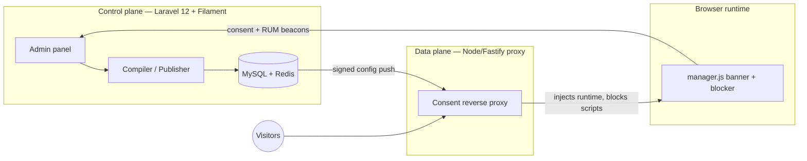

# YCookies

**Self-hosted, enterprise-grade cookie consent management (CMP)** — your own Cookiebot/Borlabs alternative, running on your infrastructure, under your control.

[](./LICENSE)
[](#requirements)
[](#requirements)
[](#-quick-start-with-docker)

YCookies serves a consent banner on your customers' websites, blocks tracking scripts *before* consent is given, records legally-sound proof of consent, and speaks the industry's standard signals — **Google Consent Mode v2**, **GTM dataLayer events**, and **IAB TCF v2.2**. A built-in scanner audits any website for trackers, and Stripe-powered billing turns the whole thing into a multi-tenant SaaS you can run for your own clients.

- 🛡️ **Compliance** — Consent Mode v2 (basic + advanced), geo rules, TCF v2.2, per-tenant consent retention, hashed-IP consent logs
- 🎨 **Premium UI/UX** — live banner preview, 250+ design controls, 4 layouts, full translation support
- ⚡ **Enterprise scale** — Redis-backed config delivery, minute-bucketed traffic metrics, built for multi-thousand-domain fleets
- 🔒 **Security** — Filament Shield roles + 2FA, CSP with nonces, audit logs, rate limiting, HMAC-authenticated internal APIs
- 🔍 **Revenue scanner** — 300+ service templates, deep scans with headless Chromium, GDPR compliance verdicts
- 💳 **SaaS billing** — Stripe subscriptions (Pro/Agency/Enterprise), per-plan domain & scan limits, onboarding wizard

---

## Architecture

YCookies runs as **three cooperating planes**:



1. **Control plane** (`ypsilondev/ycookies`) — the Filament admin panel where tenants configure domains, cookie groups, services, blockers, and banner design. Config is compiled into signed runtime revisions.
2. **Data plane** (`ypsilondev/ycookies-proxy`) — a reverse proxy in front of each customer site: injects the consent runtime into HTML, blocks third-party scripts server-side before consent, streams everything else untouched.
3. **Browser runtime** — `manager.js`, injected into pages: renders the banner, enforces consent, fires Consent Mode v2 / GTM / TCF signals, and reports consent + telemetry back.

## Requirements

- **Docker Engine 20.10+ with Compose v2** — that's it for the containerized install (`amd64`; `arm64` images ship with multi-arch releases)
- Or, for bare-metal: PHP 8.2+, Node 22+, MySQL 8, Redis 7, Composer 2, and a process manager
- A TLS terminator in front (Caddy, Traefik, nginx, or a cloud load balancer) — the stack itself speaks plain HTTP

## 🐳 Quick Start with Docker

Pre-built images on Docker Hub: [`ypsilondev/ycookies`](https://hub.docker.com/r/ypsilondev/ycookies) (control plane), [`ypsilondev/ycookies-scanner`](https://hub.docker.com/r/ypsilondev/ycookies-scanner) (scan worker with Chromium), [`ypsilondev/ycookies-proxy`](https://hub.docker.com/r/ypsilondev/ycookies-proxy) (consent reverse proxy).

```bash
git clone https://github.com/omarijbara/YCookies.git && cd YCookies/deploy
cp .env.example .env
# Fill in the 5 required values (see the Environment Reference below)
docker compose up -d

# Seed the first admin user, then log in and CHANGE THE PASSWORD:
docker compose exec app php artisan db:seed --class=AdminUserSeeder
```

Admin panel: `http://<host>:8080` · Consent proxy: `http://<host>:8081`. Route your admin domain to the app port and your customer domains to the proxy port through your TLS terminator. Full stack definition: [deploy/docker-compose.yml](./deploy/docker-compose.yml). Prefer a managed setup? Use the [Coolify installer](./INSTALLER.md).

**Maintainers:** publish the images from any Docker host — no CI required: `docker login`, then [`./scripts/publish-images.sh v1.0.0`](./scripts/publish-images.sh) (multi-arch; `PLATFORMS=linux/amd64` for a faster amd64-only build). A GitHub Actions workflow ([docker-publish.yml](./.github/workflows/docker-publish.yml)) exists as an alternative.

---

## ⚙️ Environment Reference

Configuration is environment-driven. The tables below cover every variable that matters for running YCookies; anything not listed follows stock Laravel 12 defaults (see [.env.example](./.env.example)). Template files: [deploy/.env.example](./deploy/.env.example) (Docker stack) · [.env.production.example](./.env.production.example) (Coolify/bare-metal).

Misconfiguration fails loudly: the Docker stack refuses to start with a named error when a required variable is missing, and the container entrypoint re-validates before boot.

### Required (all deployments)

| Variable | Description | Generate with |
|---|---|---|
| `APP_URL` | Public URL of the admin panel (behind TLS), e.g. `https://cookies.example.com` | — |
| `APP_KEY` | Laravel encryption key — encrypts sessions, cookies, and stored secrets | `echo "base64:$(openssl rand -base64 32)"` |
| `DB_PASSWORD` | MySQL application-user password | `openssl rand -hex 16` |
| `DB_ROOT_PASSWORD` | MySQL root password — **must differ from `DB_PASSWORD`** (Docker stack only) | `openssl rand -hex 16` |
| `PROXY_SHARED_SECRET` | HMAC secret authenticating every Node proxy ↔ Laravel request | `openssl rand -hex 32` |

### Application core

| Variable | Default | Description |
|---|---|---|
| `APP_NAME` | `Laravel` | Application name (used in mail, cache prefixes) |
| `APP_ENV` | `production` | `production` / `local` / `testing` — gates debug routes and fail-open dev behavior |
| `APP_DEBUG` | `false` | Never `true` in production |
| `APP_LOCALE` / `APP_FALLBACK_LOCALE` | `en` | Default admin/banner language |
| `ADMIN_HOST` | — | Hostname of the admin panel (used by the Coolify stack for routing) |
| `DB_CONNECTION` / `DB_HOST` / `DB_PORT` / `DB_DATABASE` / `DB_USERNAME` | `mysql` / `mysql` / `3306` / `ycookies` / `ycookies` | MySQL connection (service name `mysql` inside the Docker stack) |
| `REDIS_HOST` / `REDIS_PORT` / `REDIS_PASSWORD` | `redis` / `6379` / `null` | Redis connection |
| `REDIS_CLIENT` | `phpredis` | `phpredis` (bundled in the image) or `predis` |
| `REDIS_PREFIX` | *(empty in Docker stack)* | Global key prefix. Keys shared with the Node proxy always bypass it via dedicated connections |
| `CACHE_STORE` | `redis` (Docker) / `database` | Laravel cache backend |
| `SESSION_DRIVER` | `database` | Session backend |
| `QUEUE_CONNECTION` | `database` | Queue backend — workers consume `default`, `health`, `observability`, `scanner` queues |
| `LOG_CHANNEL` / `LOG_LEVEL` | `stderr` (Docker) / `info` | `stderr` makes logs visible via `docker logs` |

### Proxy ↔ Laravel security

| Variable | Default | Description |
|---|---|---|
| `PROXY_SHARED_SECRET` | — **(required)** | HMAC-SHA256 secret for config fetches, metrics ingest, and error reporting between the two planes |
| `PROXY_SHARED_SECRET_PREV` | — | Previous secret, accepted during rotation grace windows |
| `PROXY_PUBLIC_IP` | — | Public IP of the proxy, shown to tenants for DNS setup |

### Node proxy service (the `proxy` container)

| Variable | Default | Description |
|---|---|---|
| `LARAVEL_URL` | — **(required)** | Internal URL of the control plane, e.g. `http://app:80` |
| `PROXY_SHARED_SECRET` | — **(required)** | Must match the Laravel value |
| `NODE_ENV` | `production` | Node environment |
| `PROXY_PORT` | `80` | Listen port inside the container |
| `LARAVEL_API_HOST` | — | Admin hostname used for config pre-warming (optional) |
| `REDIS_URL` | — | e.g. `redis://redis:6379` — enables the shared config push-cache |
| `CONFIG_CACHE_TTL` | `300` | Seconds a domain config stays fresh in RAM |
| `CONFIG_MAX_STALE` | *(tuned)* | How long stale config may be served during control-plane outages |
| `CONFIG_SNAPSHOT_DIR` | `/data/config-cache` | Disk snapshot tier for cold-start resilience |
| `CACHE_ENABLED` / `METRICS_ENABLED` | `true` | Toggle the HTML edge cache / metrics reporting |
| `METRICS_FLUSH_MS` / `METRICS_BATCH_SIZE` / `METRICS_QUEUE_MAX` | *(tuned)* | Edge-metrics batching knobs |
| `POOL_CONNECTIONS_PER_ORIGIN` / `POOL_MAX_ENTRIES` / `POOL_IDLE_TIMEOUT_MS` / `POOL_KEEP_ALIVE_MS` / `POOL_KEEP_ALIVE_MAX_MS` | *(tuned)* | Upstream connection-pool tuning |
| `UPSTREAM_REQUEST_TIMEOUT_MS` | *(tuned)* | Origin fetch timeout |
| `LOG_LEVEL` | `info` | Fastify/pino log level |
| `SENTRY_NODE_DSN` | — | Error tracking for the proxy (optional) |

### Scanner

| Variable | Default | Description |
|---|---|---|
| `SCANNER_SCHEDULED_DEEP_SCAN_ENABLED` | `false` | Enable headless-Chromium deep scans on scheduled runs |
| `SCANNER_SCHEDULED_SET_CHUNK_SIZE` | `10` | Pages fetched per scheduled-scan chunk |
| `SCANNER_SCHEDULED_INTER_REQUEST_DELAY_MS` | `250` | Politeness delay between page fetches |
| `SCANNER_TARGET_SET_COUNT` / `SCANNER_MIN_SET_SIZE` / `SCANNER_MAX_SET_SIZE` | `100` / `15` / `50` | Page-set rotation across scan cycles |
| `CHROME_PATH` | *(set in scanner image)* | Chromium binary for Browsershot/Puppeteer |

### Runtime manifests (signed config artifacts)

| Variable | Default | Description |
|---|---|---|
| `RUNTIME_SIGNING_KEY` | — | Ed25519 seed (32 bytes, `openssl rand -hex 32`). Without it, each container signs with an ephemeral key — fine for dev, signatures break across restarts in production |
| `RUNTIME_COMPILE_DEBOUNCE` | `5` | Seconds to coalesce rapid config changes into one compile |
| `RUNTIME_MAX_REVISIONS` | `20` | Revisions kept per domain for rollback |
| `RUNTIME_COMPILE_QUEUE` | `default` | Queue for compile jobs |
| `MANIFEST_DIFF_MODE` | — | `shadow` compares manifest vs legacy config output for safe migration |

### Billing (Stripe / Cashier) — optional

| Variable | Description |
|---|---|
| `STRIPE_KEY` / `STRIPE_SECRET` | Stripe API keypair |
| `STRIPE_WEBHOOK_SECRET` | Webhook signing secret (`invoice.payment_failed` and subscription events drive plan enforcement) |
| `STRIPE_PRICE_PRO_MONTHLY` / `STRIPE_PRICE_AGENCY_MONTHLY` / `STRIPE_PRICE_ENTERPRISE` | Price IDs mapped to plan limits in [config/pricing.php](./config/pricing.php) |
| `CASHIER_CURRENCY` | Billing currency (default `usd`) |

Without Stripe configured, no subscriptions exist and every tenant falls back to the **free tier** (1 domain, 5 scans/month by default). For an unbilled private install, raise the `free` limits in [config/pricing.php](./config/pricing.php).

### Observability & error tracking — optional

| Variable | Description |
|---|---|
| `SENTRY_LARAVEL_DSN` / `SENTRY_NODE_DSN` | Sentry-compatible DSNs (works with self-hosted GlitchTip) |
| `SENTRY_TRACES_SAMPLE_RATE` | Performance-trace sampling (default `0.1`) |
| `GLITCHTIP_URL` / `GLITCHTIP_PUBLIC_URL` / `GLITCHTIP_API_TOKEN` / `GLITCHTIP_ORG_SLUG` | Self-hosted GlitchTip integration for issue sync in the admin panel |

### Integrations — optional

| Variable | Description |
|---|---|
| `COOLIFY_INSTANCE_URL` / `COOLIFY_API_TOKEN` / `COOLIFY_APP_UUID` / `COOLIFY_PROXY_APP_UUID` | Coolify API integration: automatic domain routing sync on the proxy app. Only for Coolify deployments |
| `SSH_HOST` | Host for the optional SSH server-maintenance features |
| `OPENROUTER_API_KEY` / `OPENROUTER_MODEL` | AI features (health-check diagnosis, daily digests). Usually configured in the admin panel (Settings → AI), which stores the key encrypted — env acts as a fallback |
| `MAIL_*` | Standard Laravel mail settings. SMTP is usually configured at runtime in the admin panel (Settings → SMTP) and overrides env |
| `BACKUP_ARCHIVE_PASSWORD` / `BACKUP_NOTIFICATION_EMAIL` | spatie/laravel-backup encryption + notifications |

---

## Consent Mode v2 Setup Guide

YCookies integrates seamlessly with Google Consent Mode v2 via an advanced dual-layer data logic architecture.

### 1. Configure the Mapping (Filament UI)

Map user-friendly cookie groups (e.g., Marketing) directly to Google backend signals (e.g., `ad_storage`, `ad_user_data`) inside the Filament domain panel.

The integration supports both basic and advanced modes.


### 2. GTM Triggers & Network Proof

Our system fires a unified event to the `dataLayer` alongside native `gtag('consent', 'update')` commands.

- Use the Custom Event trigger `ycookies_consent_update` for a single unified signal
- Per-consent triggers fire as `ycookies-opt-in-{group}` and `ycookies-opt-in-{service}` (Borlabs 3.0-compatible schema)
- Read standard signals via `consent.ad_storage` or raw groups via `ycookies.groups.marketing`

See the full [GTM Integration Guide](./docs/gtm-integration.md) for variable and trigger configurations.

**Network Execution & GTM Verification (`gcs=G111` Status)**


## Testing & Quality

The repository ships four test suites — all green:

| Suite | Command | Covers |
|---|---|---|
| PHP (PHPUnit) | `php artisan test` | Feature + unit tests: consent APIs, tenancy, scanner, GDPR erasure, authorization |
| Static analysis | `vendor/bin/phpstan analyse` | Larastan level 5 |
| JS unit (Vitest) | `npm run test:unit` | Consent engine, dataLayer contract, cookie persistence |
| Proxy regression gate | `cd services/proxy && npm test` | 480+ locked assertions: blocking parity, CSP nonces, trust boundaries, caching |

E2E (Playwright) and browser (Dusk) suites exist for staging/production smoke testing — see [TEST_PLAN.md](./TEST_PLAN.md).

## Documentation

- [Self-Hosting (Coolify / Docker)](./docs/self-hosting.md)
- [Platform Compatibility Matrix](./docs/platform-compatibility-matrix.md)
- [Custom Services & Webhooks](./docs/custom-services-webhooks.md)
- [Migration from other CMPs](./docs/migration-guide.md)
- [Troubleshooting FAQ](./docs/troubleshooting-faq.md)

## Security

Found a vulnerability? Please use [GitHub's private vulnerability reporting](../../security/advisories/new) rather than a public issue.

## License

YCookies is source-available under the [Elastic License 2.0](./LICENSE): free to use, modify, and self-host — including commercially — but you may not offer YCookies itself to third parties as a hosted/managed service or circumvent its license/plan-limit functionality.
